# Minesweeper Game - Enterprise .NET Architecture Template

A complete **Minesweeper game implementation** using .NET 9+ that demonstrates
enterprise-grade software architecture patterns including **Clean Architecture**,
**Domain-Driven Design (DDD)**, and **CQRS**. This project serves as an educational
foundation for students to explore modern .NET development practices and build
innovative extensions.

## 🎯 Project Overview

This is a **foundational template** designed for students to experiment with and
extend in creative directions. The current implementation provides a solid architectural
foundation with comprehensive business logic, while leaving room for innovative
features and wild creative directions.

### What's Implemented (Phase 1 Complete ✅)

- **Clean Architecture** with strict dependency inversion
- **Domain-Driven Design** with rich business models
- **CQRS Pattern** using MediatR for command/query separation
- **Multi-Provider Database** support (SQLite + PostgreSQL)
- **Entity Framework Core** with migrations and value object conversions
- **Repository Pattern** with security-first data access
- **Comprehensive Testing** (23 unit tests covering domain logic)
- **Backend Web API** structure with Swagger documentation (no frontend UI)

### What Students Can Build Upon

This foundation is intentionally designed to spark creativity. I have built:

- **Real-time multiplayer** modes with SignalR
- **Frontend applications** Not Currently Implemented
- **AI-powered hint systems** using machine learning
- **Social features** like tournaments and leaderboards
- **Mobile companion apps** with cross-platform synchronization
- **Data visualization** and analytics dashboards
- **Custom game modes** (time trials, collaborative solving, etc.)
- **Integration with external APIs** (authentication providers, cloud storage)

## 🚀 Getting Started

### Prerequisites

- [.NET 9 SDK](https://dotnet.microsoft.com/download/dotnet/9.0)
- [VS Code](https://code.visualstudio.com/) with C# extension (recommended)
- Basic understanding of C# and web development

### Quick Start

1. **Clone and Setup**

   ```bash
   git clone <repository-url>
   cd minesweep
   dotnet restore
   ```

2. **Run Database Migrations**

   ```bash
   dotnet ef database update --project src/Minesweeper.Infrastructure
   ```

3. **Build and Test**

   ```bash
   # Build the solution
   dotnet build
   
   # Run all tests
   dotnet test
   
   # Or use VS Code tasks (Ctrl+Shift+P → "Tasks: Run Task"):
   # - test-unit: Run only unit tests
   # - test-integration: Run only integration tests  
   # - test-coverage: Run tests with coverage
   ```

4. **Run the Application**

   ```bash
   # Start the Minesweeper API
   dotnet run --project src/Minesweeper.WebApi
   
   # Or use VS Code tasks:
   # - run: Start WebApi
   # - run-api-with-swagger: Start with HTTPS and Swagger UI
   # - run-watch: Start with hot reload
   ```

4. **Run the Application**

   ```bash
   dotnet run --project src/Minesweeper.WebApi
   ```

5. **Explore the API**
   - Navigate to `https://localhost:5001/swagger` for OpenAPI documentation
   - Try the interactive API explorer to test endpoints
   - **Note**: This is a backend-only implementation - no web frontend is included

## 🛠️ VS Code Development Workflow

This project includes optimized VS Code tasks for efficient development. Access them via **Ctrl+Shift+P → "Tasks: Run Task"**:

### 🚀 **Quick Development Tasks**

- **`run-api-with-swagger`** - Start API with HTTPS and Swagger UI (recommended for development)
- **`run-watch`** - Start API with hot reload for continuous development
- **`format`** - Format all code consistently

### 🧪 **Testing Workflow**

- **`test-unit`** - Quick unit test feedback during development
- **`test-integration`** - Full integration test validation
- **`test-coverage`** - Analyze test coverage metrics
- **`test-watch`** - Continuous testing during TDD

### 🗄️ **Database Management**

- **`ef-migrations-add`** - Add new EF Core migration (prompts for name)
- **`ef-database-update`** - Apply pending migrations
- **`ef-database-drop`** - Reset database completely
- **`ef-migrations-remove`** - Remove last migration

All tasks are pre-configured with the correct project paths and startup projects for your Clean Architecture setup.

## 📚 Architecture Documentation

### Phase 1: Infrastructure Foundation

For a **comprehensive overview** of the current implementation, see [PHASE1_SUMMARY.md](docs/PHASE1_SUMMARY.md).

This document covers:

- Complete architecture breakdown with layer dependencies
- Database schema and Entity Framework configuration
- Domain model implementation with value objects
- CQRS pattern implementation with MediatR
- Repository pattern with security considerations
- Testing strategy and coverage (23 tests)
- Performance metrics and optimization details

### Database Schema Documentation

For **detailed database design and structure**, see [DATABASE_SCHEMA.md](docs/DATABASE_SCHEMA.md).

This comprehensive document includes:

- **Visual Schema Diagrams**: Complete Mermaid ER diagrams showing all entity relationships
- **Table Specifications**: Detailed column definitions, constraints, and indexes
- **Entity Framework Configuration**: Value converters, mappings, and migration strategies
- **Performance Optimization**: Index strategies and query patterns for scalability
- **Future Enhancement Schemas**: Planned tables for authentication, tournaments, analytics, and achievements
- **Development Guidelines**: Best practices for schema changes and database maintenance

### Phase 2: Web API Integration Roadmap

For guidance on **extending the application**, see [PHASE2_PLAN.md](docs/PHASE2_PLAN.md).

This plan includes:

- Authentication system implementation (JWT-based)
- Real-time features using SignalR
- Input validation and security hardening
- API documentation and testing strategies
- Integration testing with TestContainers
- Performance optimization techniques

## 🔧 API Documentation

### Viewing OpenAPI Documentation

The project includes **Swagger/OpenAPI** documentation for exploring and testing the API:

1. **Start the application**:

   ```bash
   dotnet run --project src/Minesweeper.WebApi
   ```

2. **Open your browser** to:
   - **Swagger UI**: `https://localhost:5001/swagger`
   - **OpenAPI JSON**: `https://localhost:5001/swagger/v1/swagger.json`

3. **Interactive Testing**:
   - Use the Swagger UI to test endpoints directly
   - View request/response schemas
   - Explore example payloads

### Adding Documentation for New Endpoints

When you add new controllers or endpoints, follow these practices to maintain comprehensive documentation:

#### 1. XML Documentation Comments

Add detailed XML comments to your controller actions:

```csharp
/// <summary>
/// Creates a new minesweeper game for the authenticated player
/// </summary>
/// <param name="request">Game creation parameters including difficulty level</param>
/// <param name="idempotencyKey">Optional key to prevent duplicate game creation</param>
/// <returns>The created game with initial state information</returns>
/// <response code="201">Game created successfully</response>
/// <response code="400">Invalid request parameters</response>
/// <response code="401">User not authenticated</response>
[HttpPost]
[ProducesResponseType(typeof(GameDto), StatusCodes.Status201Created)]
[ProducesResponseType(typeof(ApiErrorResponse), StatusCodes.Status400BadRequest)]
[ProducesResponseType(StatusCodes.Status401Unauthorized)]
public async Task<ActionResult<GameDto>> CreateGame(
    [FromBody] CreateGameRequest request,
    [FromHeader(Name = "Idempotency-Key")] string? idempotencyKey)
{
    // Implementation here
}
```

#### 2. Request/Response Models

Document your DTOs with XML comments:

```csharp
/// <summary>
/// Request model for creating a new minesweeper game
/// </summary>
public class CreateGameRequest
{
    /// <summary>
    /// The difficulty level for the new game (Beginner, Intermediate, Expert, or Custom)
    /// </summary>
    /// <example>Beginner</example>
    public GameDifficulty Difficulty { get; set; }

    /// <summary>
    /// Optional custom board dimensions (required if Difficulty is Custom)
    /// </summary>
    public CustomDifficultyRequest? CustomDifficulty { get; set; }
}
```

#### 3. Swagger Configuration

The project is configured to automatically include XML documentation. To enable documentation for new projects:

```csharp
// In Program.cs
builder.Services.AddSwaggerGen(c =>
{
    c.SwaggerDoc("v1", new OpenApiInfo 
    { 
        Title = "Minesweeper API", 
        Version = "v1",
        Description = "Enterprise Minesweeper game API with Clean Architecture"
    });
    
    // Include XML comments
    var xmlFile = $"{Assembly.GetExecutingAssembly().GetName().Name}.xml";
    var xmlPath = Path.Combine(AppContext.BaseDirectory, xmlFile);
    c.IncludeXmlComments(xmlPath);
    
    // Add authentication documentation
    c.AddSecurityDefinition("Bearer", new OpenApiSecurityScheme
    {
        Description = "JWT Authorization header using the Bearer scheme",
        Name = "Authorization",
        In = ParameterLocation.Header,
        Type = SecuritySchemeType.Http,
        Scheme = "bearer"
    });
});
```

#### 4. Enable XML Documentation Generation

Ensure your project files generate XML documentation:

```xml
<!-- In your .csproj file -->
<PropertyGroup>
  <GenerateDocumentationFile>true</GenerateDocumentationFile>
  <NoWarn>$(NoWarn);1591</NoWarn> <!-- Suppress missing XML comment warnings -->
</PropertyGroup>
```

## 🎮 Current Game Features

### Core Minesweeper Logic (Complete Implementation ✅)

This project includes a **production-quality, feature-complete** implementation of all classic Minesweeper game mechanics:

#### **Mine Placement & Safety**

- **Safe First Click**: Mines are placed AFTER the first click, ensuring it's never a mine
- **Random Mine Distribution**: Proper randomization algorithm for mine placement
- **Adjacent Cell Protection**: First click and its 8 neighbors are guaranteed mine-free
- **Configurable Difficulties**: Beginner (9×9, 10 mines), Intermediate (16×16, 40 mines), Expert (16×30, 99 mines), Custom sizes

#### **Advanced Cell Operations**

- **Cell Revealing**: Complete state management (Hidden → Revealed)
- **Flagging System**: Toggle flags on suspected mines (Hidden ↔ Flagged)
- **Question Marks**: Optional questioning state for uncertain cells (Hidden ↔ Questioned)
- **Adjacent Mine Counting**: Accurate calculation and display of neighboring mines (1-8)

#### **Intelligent Game Mechanics**

- **Flood Fill Algorithm**: When revealing empty cells (0 adjacent mines), automatically reveals all connected empty regions using breadth-first search
- **Cascade Reveal**: Efficiently processes large empty areas with optimized queue-based algorithm
- **Win/Loss Detection**:
  - **Win Condition**: All safe cells revealed (mines can remain unflagged)
  - **Loss Condition**: Any mine revealed
- **Mine Revelation**: All mines revealed when game is lost

#### **Game State Management**

- **Multiple States**: NotStarted → InProgress → Won/Lost, with Paused state support
- **Pause/Resume**: Accurate time tracking with pause duration compensation
- **Statistics Tracking**: Progress percentage, remaining mines, elapsed time, cells revealed
- **Game Duration**: Precise timing with pause handling and completion timestamps

#### **Professional Game Features**

- **Remaining Mine Counter**: Dynamically calculated (total mines - flags placed)
- **Progress Tracking**: Real-time percentage of safe cells revealed
- **Visual Representation**: Emoji support (💣 mines, 🚩 flags, ❓ questions, ■ hidden)
- **Debug Information**: Board state visualization for development and testing

### Domain Logic (Fully Implemented)

- **Game Creation**: Multiple difficulty levels (Beginner, Intermediate, Expert, Custom)
- **Game State Management**: Proper state transitions and validation
- **Mine Generation**: Safe first-click guarantee with random mine placement
- **Cell Operations**: Reveal, flag/unflag with flood-fill for empty regions
- **Win/Loss Detection**: Automatic game completion detection
- **Statistics Tracking**: Player performance metrics and game history

### Data Persistence

- **Multi-Database Support**: SQLite (development) and PostgreSQL (production)
- **Entity Framework Core**: Advanced ORM with value object conversions
- **Migration System**: Database schema versioning and updates
- **Repository Pattern**: Secure, player-scoped data access

### API Structure (Basic Implementation)

- **Games Controller**: CRUD operations for game management
- **RESTful Design**: Following REST principles with proper HTTP status codes
- **Error Handling**: Standardized error responses
- **Swagger Documentation**: Interactive API exploration
- **No Frontend**: Backend API only - frontend implementation left to students

## 🛠️ Architecture Patterns

### Clean Architecture Layers

```mermaid
flowchart TB
    subgraph "Presentation Layer"
        direction LR
        Controllers[Controllers]
        SignalR[SignalR Hubs]
        WebApi["🌐 Minesweeper.WebApi"]
    end

    subgraph "Application Layer"
        direction LR
        Commands[Commands]
        Queries[Queries]
        DTOs[DTOs]
        AppLayer["🎯 Minesweeper.Application"]
    end

    subgraph "Infrastructure Layer"
        direction LR
        EFCore[EF Core]
        Repositories[Repositories]
        InfraLayer["🔧 Minesweeper.Infrastructure"]
    end

    subgraph "Domain Layer"
        direction LR
        Entities[Entities]
        ValueObjects[Value Objects]
        DomainLayer["🏗️ Minesweeper.Domain"]
    end

    %% Dependencies flow inward
    Controllers -.->|depends on| Commands
    SignalR -.->|depends on| Queries
    WebApi -.->|depends on| AppLayer

    Commands -.->|depends on| Entities
    Queries -.->|depends on| ValueObjects
    AppLayer -.->|depends on| DomainLayer

    EFCore -.->|implements| Entities
    Repositories -.->|implements| ValueObjects
    InfraLayer -.->|implements| DomainLayer

    %% Styling
    classDef presentation fill:#e1f5fe,stroke:#01579b,stroke-width:2px
    classDef application fill:#f3e5f5,stroke:#4a148c,stroke-width:2px
    classDef infrastructure fill:#e8f5e8,stroke:#1b5e20,stroke-width:2px
    classDef domain fill:#fff3e0,stroke:#e65100,stroke-width:2px

    class Controllers,SignalR,WebApi presentation
    class Commands,Queries,DTOs,AppLayer application
    class EFCore,Repositories,InfraLayer infrastructure
    class Entities,ValueObjects,DomainLayer domain
```



### Key Patterns Demonstrated

- **Domain-Driven Design**: Rich domain models with business logic
- **CQRS**: Command/Query responsibility segregation
- **Repository Pattern**: Data access abstraction
- **Value Objects**: Strongly-typed domain values
- **Result Pattern**: Railway-oriented programming for error handling

## 🚀 Student Project Ideas

This foundation supports countless creative directions. Here are some ideas to get you started:

### 🎯 Beginner Extensions

- **Frontend Development**: Build web, mobile, or desktop interfaces
- **Custom Themes**: UI themes and visual customizations (requires frontend)
- **Sound Effects**: Audio feedback for game actions (requires frontend)
- **Game Variants**: Different board shapes or rule modifications
- **Statistics Dashboard**: Advanced player analytics and charts

### 🎯 Intermediate Projects

- **Web Frontend**: React, Angular, Vue.js, or Blazor client applications
- **Mobile Apps**: Xamarin, MAUI, React Native, or Flutter applications
- **Real-time Multiplayer**: Competitive or collaborative gameplay
- **AI Assistance**: Hint systems and auto-solving algorithms
- **Mobile API**: Dedicated endpoints for mobile applications
- **Social Features**: Friend systems, leaderboards, achievements

### 🎯 Advanced Challenges

- **Machine Learning**: Pattern recognition for cheating detection
- **Microservices**: Break apart into distributed services
- **Event Sourcing**: Complete event-driven architecture
- **Cloud Integration**: Azure/AWS deployment with scaling

### 🎯 Creative Directions

- **3D Minesweeper**: Three-dimensional gameplay mechanics
- **Educational Mode**: Teaching probability and logical reasoning
- **Tournament System**: Competitive events and rankings
- **API Integrations**: Social media sharing, external authentication

## 🧪 Testing

### Running Tests

```bash
# Run all tests (unit + integration)
dotnet test

# Run with detailed output
dotnet test --logger console;verbosity=detailed

# Run specific test projects
dotnet test tests/Minesweeper.UnitTests/
dotnet test tests/Minesweeper.IntegrationTests/

# Run with code coverage
dotnet test --collect:"XPlat Code Coverage"
```

**VS Code Task Shortcuts** (Ctrl+Shift+P → "Tasks: Run Task"):

- `test` - Run all tests
- `test-unit` - Run only unit tests
- `test-integration` - Run only integration tests
- `test-coverage` - Run tests with coverage analysis
- `test-watch` - Continuous testing during development

### Test Coverage

Current test coverage focuses on domain logic:

- **Domain Entities**: 16 tests covering game logic and rules
- **Value Objects**: 7 tests for validation and behavior
- **Integration**: 1 test for basic repository functionality

### Adding Tests for New Features

When extending the application, maintain test coverage:

```csharp
[Fact]
public void YourNewFeature_WithValidInput_ShouldBehaveCorrectly()
{
    // Arrange
    var expected = "expectedResult";
    
    // Act
    var result = systemUnderTest.YourNewMethod(validInput);
    
    // Assert
    result.Should().Be(expected);
}
```

## 🔧 Development Workflow

### VS Code Tasks

The project includes predefined VS Code tasks (accessible via `Ctrl+Shift+P` → "Tasks: Run Task"):

- **build**: Build the entire solution
- **test**: Run all unit tests
- **run**: Start the web API
- **ef-migrations-add**: Add a new Entity Framework migration
- **ef-database-update**: Apply pending migrations

### Environment Configuration

- **Development**: Uses SQLite database (`minesweeper_dev.db`)
- **Production**: Configured for PostgreSQL (connection string in `appsettings.Production.json`)

## 📈 Performance Considerations

The current implementation includes several performance optimizations:

- **Database Indexing**: Strategic indexes on frequently queried columns
- **Entity Framework**: Optimized queries with selective loading
- **Connection Pooling**: Built-in EF Core connection management
- **Caching**: Ready for implementation with dependency injection

## 🔒 Security Features

- **Input Validation**: Domain-level validation for all operations
- **SQL Injection Prevention**: EF Core parameterized queries
- **Player-Scoped Access**: Repository methods enforce data isolation
- **Prepared for Authentication**: Structure ready for JWT implementation

## 📄 License

This project is dual-licensed:

- **Main Project**: [Creative Commons Attribution 4.0 International License](LICENSE) - Free for educational and commercial use with attribution
- **Development Documentation**: [Proprietary License](docs/dev/LICENSE) - Restricted use for development materials

## 🤝 Contributing

This project is designed as an educational foundation. Students are encouraged to:

1. **Fork the repository** and create your own creative extensions
2. **Document your innovations** in your own README files
3. **Share your projects** with the community to inspire others
4. **Maintain the architectural principles** while exploring new directions

## 🎓 Learning Objectives

By working with this codebase, students will gain practical experience with:

- **Enterprise Architecture Patterns**: Clean Architecture, DDD, CQRS
- **Modern .NET Development**: .NET 9, Entity Framework Core, MediatR
- **Database Design**: Migrations, indexing, multi-provider support
- **API Development**: RESTful design, documentation, testing
- **Software Engineering Practices**: Testing, documentation, code quality

## 📞 Support and Resources

- **Architecture Details**: See [PHASE1_SUMMARY.md](docs/PHASE1_SUMMARY.md)
- **Extension Guidelines**: See [PHASE2_PLAN.md](docs/PHASE2_PLAN.md)
- **Development Documentation**: See `docs/dev/` folder
- **API Documentation**: Available at `/swagger` when running the application

---

**Ready to build something amazing?** This foundation provides enterprise-grade architecture while leaving infinite possibilities for creative extension. Whether you're interested in AI, real-time features, mobile development, or completely novel game mechanics, this codebase gives you a solid starting point.

**What will you create?** 🚀
