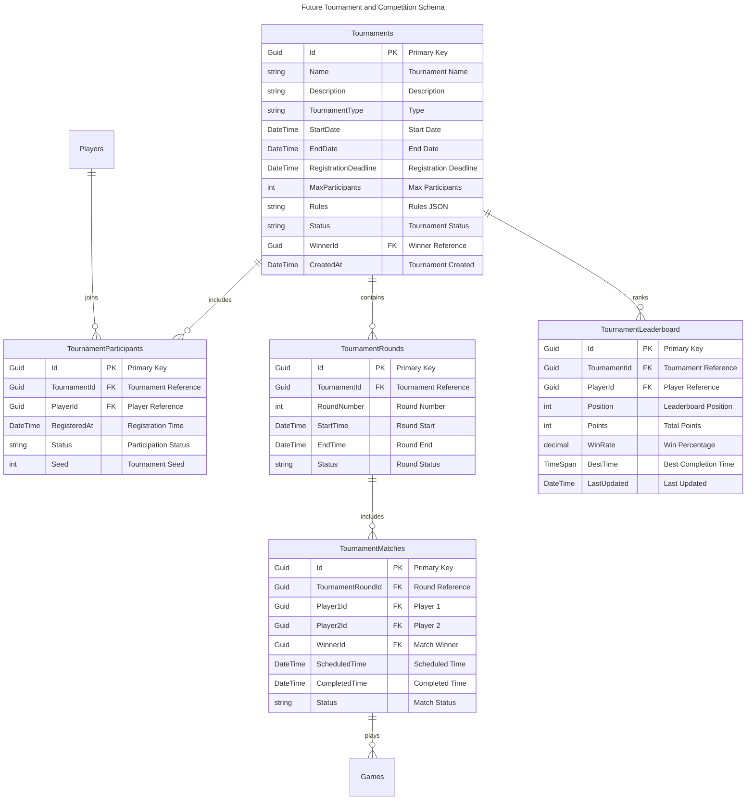

# Database Schema Documentation

## Overview

This document describes the complete database schema for the Minesweeper Game application. The schema is designed using **Entity Framework Core** with support for multiple database providers (SQLite for development, PostgreSQL for production) and follows **Domain-Driven Design** principles with rich domain models.

## Database Providers

- **Development**: SQLite (file-based, easy setup)
- **Production**: PostgreSQL (scalable, enterprise-grade)
- **Testing**: In-Memory Provider (fast unit tests)

## Schema Version

- **Current Version**: 1.0
- **Last Updated**: August 5, 2025
- **EF Core Version**: 9.0+

---

## Schema Architecture Overview


---

## Tables

### Games

**Purpose**: Core game entity representing individual Minesweeper game sessions

| Column                | Type                      | Constraints                    | Description                                                    |
| --------------------- | ------------------------- | ------------------------------ | -------------------------------------------------------------- |
| `Id`                  | `uniqueidentifier` (GUID) | **PRIMARY KEY**, NOT NULL      | Unique game identifier                                         |
| `PlayerId`            | `uniqueidentifier` (GUID) | **FOREIGN KEY**, NOT NULL      | Reference to Players table                                     |
| `DifficultyName`      | `nvarchar(50)`            | NOT NULL                       | Difficulty level name (Beginner, Intermediate, Expert, Custom) |
| `DifficultyWidth`     | `int`                     | NOT NULL                       | Board width in cells                                           |
| `DifficultyHeight`    | `int`                     | NOT NULL                       | Board height in cells                                          |
| `DifficultyMineCount` | `int`                     | NOT NULL                       | Total number of mines                                          |
| `Status`              | `nvarchar(20)`            | NOT NULL                       | Game status (NotStarted, InProgress, Won, Lost, Paused)        |
| `StartTime`           | `datetime2`               | NOT NULL                       | Game creation timestamp                                        |
| `EndTime`             | `datetime2`               | NULL                           | Game completion timestamp                                      |
| `FirstClickTime`      | `datetime2`               | NULL                           | First cell reveal timestamp                                    |
| `MoveCount`           | `int`                     | NOT NULL, DEFAULT 0            | Number of moves made                                           |
| `FlagCount`           | `int`                     | NOT NULL, DEFAULT 0            | Number of flags placed                                         |
| `IsPaused`            | `bit`                     | NOT NULL, DEFAULT 0            | Whether game is currently paused                               |
| `PausedDuration`      | `bigint`                  | NOT NULL, DEFAULT 0            | Total paused time in ticks                                     |
| `CreatedAt`           | `datetime2`               | NOT NULL, DEFAULT GETUTCDATE() | Record creation timestamp                                      |
| `UpdatedAt`           | `datetime2`               | NOT NULL, DEFAULT GETUTCDATE() | Record last update timestamp                                   |

**Indexes:**

- `IX_Games_PlayerId` - Non-clustered index on PlayerId for player game queries
- `IX_Games_Status` - Non-clustered index on Status for game state filtering
- `IX_Games_StartTime` - Non-clustered index on StartTime for chronological queries

**Constraints:**

- `CHK_Games_Dimensions` - Width and Height must be between 1 and 100
- `CHK_Games_MineCount` - MineCount must be less than (Width × Height)
- `CHK_Games_MoveCount` - MoveCount must be non-negative
- `CHK_Games_FlagCount` - FlagCount must be non-negative and ≤ MineCount

### Players

**Purpose**: Player entity representing registered users

| Column                 | Type                      | Constraints                    | Description                                      |
| ---------------------- | ------------------------- | ------------------------------ | ------------------------------------------------ |
| `Id`                   | `uniqueidentifier` (GUID) | **PRIMARY KEY**, NOT NULL      | Unique player identifier                         |
| `Username`             | `nvarchar(50)`            | **UNIQUE**, NOT NULL           | Player username                                  |
| `Email`                | `nvarchar(256)`           | **UNIQUE**, NOT NULL           | Player email address                             |
| `DisplayName`          | `nvarchar(100)`           | NOT NULL                       | Player display name                              |
| `TotalGames`           | `int`                     | NOT NULL, DEFAULT 0            | Total games played                               |
| `GamesWon`             | `int`                     | NOT NULL, DEFAULT 0            | Total games won                                  |
| `GamesLost`            | `int`                     | NOT NULL, DEFAULT 0            | Total games lost                                 |
| `TotalPlayTime`        | `bigint`                  | NOT NULL, DEFAULT 0            | Total play time in ticks                         |
| `BestTimeEasy`         | `bigint`                  | NULL                           | Best completion time for easy difficulty         |
| `BestTimeIntermediate` | `bigint`                  | NULL                           | Best completion time for intermediate difficulty |
| `BestTimeExpert`       | `bigint`                  | NULL                           | Best completion time for expert difficulty       |
| `CurrentStreak`        | `int`                     | NOT NULL, DEFAULT 0            | Current winning streak                           |
| `LongestStreak`        | `int`                     | NOT NULL, DEFAULT 0            | Longest winning streak achieved                  |
| `CreatedAt`            | `datetime2`               | NOT NULL, DEFAULT GETUTCDATE() | Account creation timestamp                       |
| `LastActiveAt`         | `datetime2`               | NOT NULL, DEFAULT GETUTCDATE() | Last activity timestamp                          |

**Indexes:**

- `IX_Players_Username` - Unique index on Username for login queries
- `IX_Players_Email` - Unique index on Email for authentication
- `IX_Players_LastActiveAt` - Non-clustered index for activity tracking

**Constraints:**

- `CHK_Players_Username` - Username length between 3 and 50 characters
- `CHK_Players_Email` - Valid email format
- `CHK_Players_Games` - GamesWon + GamesLost ≤ TotalGames
- `CHK_Players_Streaks` - CurrentStreak ≤ LongestStreak

### GameBoards

**Purpose**: Game board state including cell data and mine positions

| Column           | Type                      | Constraints                      | Description                    |
| ---------------- | ------------------------- | -------------------------------- | ------------------------------ |
| `GameId`         | `uniqueidentifier` (GUID) | **PRIMARY KEY**, **FOREIGN KEY** | Reference to Games table       |
| `Width`          | `int`                     | NOT NULL                         | Board width in cells           |
| `Height`         | `int`                     | NOT NULL                         | Board height in cells          |
| `MineCount`      | `int`                     | NOT NULL                         | Total number of mines          |
| `MinesGenerated` | `bit`                     | NOT NULL, DEFAULT 0              | Whether mines have been placed |
| `CellsData`      | `nvarchar(MAX)`           | NOT NULL                         | JSON serialized cell states    |
| `MinePositions`  | `nvarchar(MAX)`           | NULL                             | JSON serialized mine positions |
| `RevealedCount`  | `int`                     | NOT NULL, DEFAULT 0              | Number of revealed cells       |
| `FlaggedCount`   | `int`                     | NOT NULL, DEFAULT 0              | Number of flagged cells        |

**Indexes:**

- `PK_GameBoards` - Primary key on GameId
- `IX_GameBoards_Dimensions` - Composite index on Width, Height for dimension queries

**Constraints:**

- `CHK_GameBoards_Dimensions` - Width and Height must be positive
- `CHK_GameBoards_MineCount` - MineCount must be less than (Width × Height)
- `CHK_GameBoards_Counts` - RevealedCount and FlaggedCount must be non-negative

---

## Value Objects

### GameDifficulty (Embedded in Games table)

Represents different difficulty levels with predefined and custom options.

**Predefined Difficulties:**

- **Beginner**: 9×9 grid, 10 mines
- **Intermediate**: 16×16 grid, 40 mines  
- **Expert**: 16×30 grid, 99 mines
- **Custom**: User-defined dimensions and mine count

### CellPosition (Used in JSON serialization)

Represents a position on the game board with row and column coordinates.

```json
{
  "Row": 0,
  "Column": 0
}
```

### CellState (Used in JSON serialization)

Represents the state of individual cells on the game board.

**States:**

- `Hidden` (0) - Cell not yet revealed
- `Revealed` (1) - Cell has been revealed
- `Flagged` (2) - Cell marked as potential mine
- `Questioned` (3) - Cell marked with question mark

---

## Relationships

### Core Game Entity Relationships


### Game Logic Flow Diagram


### Game Difficulty Value Object Schema


### Cell State Management Schema


### Database Performance Index Strategy


### Games → Players

- **Type**: Many-to-One
- **Foreign Key**: `Games.PlayerId` → `Players.Id`
- **Delete Behavior**: Restrict (cannot delete player with existing games)
- **Description**: Each game belongs to exactly one player; players can have multiple games

### GameBoards → Games

- **Type**: One-to-One
- **Foreign Key**: `GameBoards.GameId` → `Games.Id`
- **Delete Behavior**: Cascade (delete board when game is deleted)
- **Description**: Each game has exactly one board; each board belongs to exactly one game

---

## Future Enhancements Schema

### Authentication & Security Schema (Planned)


### Tournament & Competition Schema (Planned)



### Advanced Analytics Schema (Planned)


### Achievement System Schema (Planned)


---

## Entity Framework Configuration

### Connection Strings

**Development (SQLite):**

```json
{
  "ConnectionStrings": {
    "DefaultConnection": "Data Source=minesweeper.db"
  }
}
```

**Production (PostgreSQL):**

```json
{
  "ConnectionStrings": {
    "DefaultConnection": "Host=localhost;Database=minesweeper;Username=app_user;Password=secure_password"
  }
}
```

### Value Converters

#### GameDifficulty Converter

Converts the `GameDifficulty` value object to/from JSON for database storage.

```csharp
public class GameDifficultyConverter : ValueConverter<GameDifficulty, string>
{
    public GameDifficultyConverter() : base(
        v => JsonSerializer.Serialize(v, JsonSerializerOptions.Default),
        v => JsonSerializer.Deserialize<GameDifficulty>(v, JsonSerializerOptions.Default))
    { }
}
```

#### CellPosition Converter  

Converts `CellPosition` value objects to/from JSON for collections.

```csharp
public class CellPositionListConverter : ValueConverter<List<CellPosition>, string>
{
    public CellPositionListConverter() : base(
        v => JsonSerializer.Serialize(v, JsonSerializerOptions.Default),
        v => JsonSerializer.Deserialize<List<CellPosition>>(v, JsonSerializerOptions.Default) ?? new())
    { }
}
```

### Entity Configurations

#### GameConfiguration

```csharp
public class GameConfiguration : IEntityTypeConfiguration<Game>
{
    public void Configure(EntityTypeBuilder<Game> builder)
    {
        builder.HasKey(g => g.Id);
        builder.Property(g => g.Id).HasConversion(id => id.Value, value => new GameId(value));
        
        builder.Property(g => g.PlayerId).HasConversion(id => id.Value, value => new PlayerId(value));
        
        builder.Property(g => g.Difficulty)
               .HasConversion<GameDifficultyConverter>()
               .HasColumnType("nvarchar(max)");
               
        builder.Property(g => g.Status)
               .HasConversion<string>()
               .HasMaxLength(20);
    }
}
```

#### PlayerConfiguration

```csharp
public class PlayerConfiguration : IEntityTypeConfiguration<Player>
{
    public void Configure(EntityTypeBuilder<Player> builder)
    {
        builder.HasKey(p => p.Id);
        builder.Property(p => p.Id).HasConversion(id => id.Value, value => new PlayerId(value));
        
        builder.Property(p => p.Username).HasMaxLength(50).IsRequired();
        builder.Property(p => p.Email).HasMaxLength(256).IsRequired();
        builder.Property(p => p.DisplayName).HasMaxLength(100).IsRequired();
        
        builder.HasIndex(p => p.Username).IsUnique();
        builder.HasIndex(p => p.Email).IsUnique();
    }
}
```

#### GameBoardConfiguration

```csharp
public class GameBoardConfiguration : IEntityTypeConfiguration<GameBoard>
{
    public void Configure(EntityTypeBuilder<GameBoard> builder)
    {
        builder.HasKey(gb => gb.GameId);
        builder.Property(gb => gb.GameId).HasConversion(id => id.Value, value => new GameId(value));
        
        builder.Property(gb => gb.CellsData)
               .HasColumnType("nvarchar(max)")
               .IsRequired();
               
        builder.Property(gb => gb.MinePositions)
               .HasColumnType("nvarchar(max)");
    }
}
```

---

## Migration History

### Initial Migration (20250805_Initial)

- Created `Players` table with user management fields
- Created `Games` table with game state tracking
- Created `GameBoards` table with board data storage
- Added primary keys and foreign key relationships
- Added initial indexes for common query patterns

### Future Migrations (Planned)

- Authentication tables (Users, Roles, Claims)
- Audit trail tables for game actions
- Tournament and leaderboard tables
- Game replay and statistics tables

---

## Query Patterns

### Common Queries

#### Get Player's Recent Games

```sql
SELECT g.Id, g.Status, g.StartTime, g.EndTime, g.MoveCount
FROM Games g
WHERE g.PlayerId = @playerId
ORDER BY g.StartTime DESC
OFFSET @skip ROWS FETCH NEXT @take ROWS ONLY;
```

#### Get Player Statistics

```sql
SELECT 
    p.TotalGames,
    p.GamesWon,
    p.GamesLost,
    CAST(p.GamesWon AS FLOAT) / NULLIF(p.TotalGames, 0) * 100 AS WinPercentage,
    p.CurrentStreak,
    p.LongestStreak
FROM Players p
WHERE p.Id = @playerId;
```

#### Get Active Games Count

```sql
SELECT COUNT(*)
FROM Games g
WHERE g.Status IN ('NotStarted', 'InProgress', 'Paused');
```

### Performance Considerations

#### Indexes for Common Queries

- `IX_Games_PlayerId_Status` - Composite index for player's active games
- `IX_Games_StartTime_Status` - Composite index for recent games by status
- `IX_Players_LastActiveAt` - Index for finding inactive players

#### Query Optimization

- Use pagination for large result sets
- Implement proper caching for player statistics
- Consider read replicas for reporting queries

---

## Data Integrity

### Constraints Summary

1. **Business Rules**
   - Mine count must be less than total cells
   - Games won + lost cannot exceed total games
   - Current streak cannot exceed longest streak

2. **Data Validation**
   - Username and email uniqueness
   - Positive values for dimensions and counts
   - Valid email format enforcement

3. **Referential Integrity**
   - Games must reference valid players
   - GameBoards must reference valid games
   - Cascade deletes for dependent entities

### Audit Trail (Future Enhancement)

Planned audit table structure for tracking all game actions:

```sql
CREATE TABLE GameAuditLog (
    Id UNIQUEIDENTIFIER PRIMARY KEY,
    GameId UNIQUEIDENTIFIER NOT NULL,
    PlayerId UNIQUEIDENTIFIER NOT NULL,
    Action NVARCHAR(50) NOT NULL, -- 'CellRevealed', 'CellFlagged', etc.
    Position NVARCHAR(20), -- JSON: {"Row": 0, "Column": 0}
    Timestamp DATETIME2 NOT NULL,
    ClientTimestamp DATETIME2,
    Duration BIGINT, -- Time since last action
    FOREIGN KEY (GameId) REFERENCES Games(Id),
    FOREIGN KEY (PlayerId) REFERENCES Players(Id)
);
```

---

## Security Considerations

### Data Protection

- Player passwords will be hashed using BCrypt (when authentication is added)
- Sensitive player data encrypted at rest
- Connection strings secured in Azure Key Vault (production)

### Access Control

- Row-level security to ensure players can only access their own games
- Database user permissions follow principle of least privilege
- Regular security audits of database access patterns

### Backup Strategy

- Daily automated backups for production databases
- Point-in-time recovery capability
- Backup encryption and secure storage

---

## Monitoring and Maintenance

### Performance Monitoring

- Query execution time tracking
- Database connection pool monitoring
- Index usage statistics

### Maintenance Tasks

- Regular index maintenance and statistics updates
- Cleanup of old game data (retention policy)
- Database size monitoring and growth planning

---

## Development Guidelines

### Adding New Tables

1. Create entity class following DDD principles
2. Add Entity Framework configuration
3. Create and apply migration
4. Update this documentation
5. Add appropriate indexes and constraints

### Schema Changes

1. Use Entity Framework migrations for all schema changes
2. Test migrations on development database first
3. Plan downtime for production deployments
4. Keep this documentation synchronized with actual schema

### Performance Testing

1. Test queries with realistic data volumes
2. Monitor query execution plans
3. Validate index effectiveness
4. Load test database under concurrent access

---

*Last Updated: August 5, 2025*  
*Document Version: 1.0*  
*Schema Version: 1.0*
