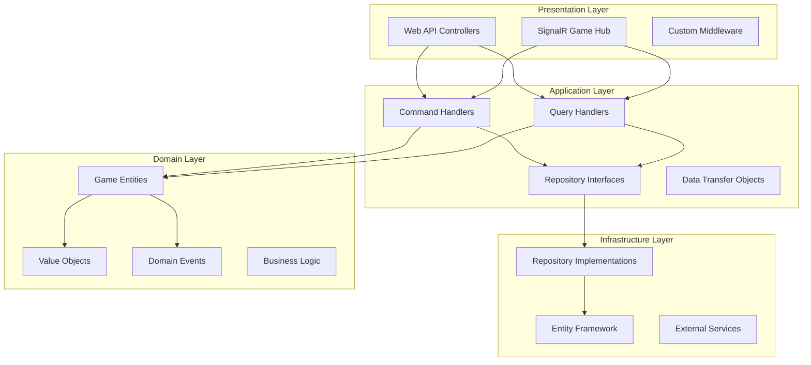

# Minesweeper Game Architecture

## Overview

This document describes the architecture of a complete Minesweeper game implementation using .NET 9 with Clean Architecture, Domain-Driven Design (DDD), and CQRS patterns. The system is designed to be maintainable, testable, and extensible while providing a secure and performant gaming experience.

## Architecture Principles

### Clean Architecture

The system follows Clean Architecture principles with strict dependency rules:

```text
Domain ← Application ← Infrastructure ← Presentation
```

- **Inner layers** contain business logic and are framework-agnostic
- **Outer layers** handle technical concerns and depend on inner layers
- **Dependency Inversion** ensures business logic doesn't depend on implementation details

### Domain-Driven Design (DDD)

- **Ubiquitous Language**: Game terminology used consistently across code and documentation
- **Bounded Context**: Single context focused on Minesweeper game mechanics
- **Rich Domain Models**: Entities contain behavior, not just data
- **Value Objects**: Immutable objects for positions, difficulty levels, etc.
- **Domain Events**: Capture significant game state changes

### CQRS (Command Query Responsibility Segregation)

- **Commands**: Operations that change game state (start game, reveal cell, flag cell)
- **Queries**: Operations that retrieve game data (get game state, get statistics)
- **Handlers**: Dedicated handlers for each command and query using MediatR
- **Separation**: Clear distinction between reads and writes

## System Architecture

### Layer Structure



## Domain Model

### Core Entities

#### Game (Aggregate Root)

```csharp
public class Game : Entity<Guid>
{
    public GameId Id { get; private set; }
    public PlayerId PlayerId { get; private set; }
    public GameDifficulty Difficulty { get; private set; }
    public GameStatus Status { get; private set; }
    public GameBoard Board { get; private set; }
    public DateTime StartTime { get; private set; }
    public DateTime? EndTime { get; private set; }
    public int MoveCount { get; private set; }
    public TimeSpan? ElapsedTime => EndTime?.Subtract(StartTime);
    
    // Rich behavior methods
    public Result RevealCell(CellPosition position);
    public Result FlagCell(CellPosition position);
    public void StartGame();
    public void EndGame(GameResult result);
}
```

#### GameBoard

```csharp
public class GameBoard : Entity<Guid>
{
    public int Width { get; private set; }
    public int Height { get; private set; }
    public int MineCount { get; private set; }
    private readonly Cell[,] _cells;
    
    public Result RevealCell(CellPosition position);
    public Result FlagCell(CellPosition position);
    public bool IsGameWon();
    public void GenerateMines(CellPosition firstClickPosition);
}
```

#### Cell

```csharp
public class Cell : Entity<Guid>
{
    public CellPosition Position { get; private set; }
    public CellState State { get; private set; }
    public bool HasMine { get; private set; }
    public int AdjacentMineCount { get; private set; }
    
    public Result Reveal();
    public Result ToggleFlag();
    public void SetMine();
    public void CalculateAdjacentMines(Cell[,] board);
}
```

#### Player

```csharp
public class Player : Entity<Guid>
{
    public PlayerId Id { get; private set; }
    public string Username { get; private set; }
    public PlayerStatistics Statistics { get; private set; }
    public List<Game> GameHistory { get; private set; }
    
    public void UpdateStatistics(GameResult result);
}
```

### Value Objects

#### CellPosition

```csharp
public record CellPosition(int Row, int Column)
{
    public static CellPosition Create(int row, int column)
    {
        if (row < 0 || column < 0)
            throw new ArgumentException("Position coordinates must be non-negative");
        return new CellPosition(row, column);
    }
    
    public IEnumerable<CellPosition> GetAdjacentPositions()
    {
        for (int r = Row - 1; r <= Row + 1; r++)
        {
            for (int c = Column - 1; c <= Column + 1; c++)
            {
                if (r != Row || c != Column)
                    yield return new CellPosition(r, c);
            }
        }
    }
}
```

#### GameDifficulty

```csharp
public record GameDifficulty(string Name, int Width, int Height, int MineCount)
{
    public static GameDifficulty Beginner => new("Beginner", 9, 9, 10);
    public static GameDifficulty Intermediate => new("Intermediate", 16, 16, 40);
    public static GameDifficulty Expert => new("Expert", 30, 16, 99);
    
    public static GameDifficulty Custom(int width, int height, int mineCount)
    {
        ValidateDimensions(width, height, mineCount);
        return new GameDifficulty("Custom", width, height, mineCount);
    }
    
    private static void ValidateDimensions(int width, int height, int mineCount)
    {
        if (width < 1 || height < 1)
            throw new ArgumentException("Board dimensions must be positive");
        if (mineCount >= width * height)
            throw new ArgumentException("Mine count must be less than total cells");
    }
}
```

#### GameStatus

```csharp
public enum GameStatus
{
    NotStarted,
    InProgress,
    Won,
    Lost
}
```

#### CellState

```csharp
public enum CellState
{
    Hidden,
    Revealed,
    Flagged
}
```

### Domain Events

```csharp
public record GameStartedEvent(GameId GameId, PlayerId PlayerId, DateTime StartTime) : IDomainEvent;

public record CellRevealedEvent(GameId GameId, CellPosition Position, bool HadMine) : IDomainEvent;

public record CellFlaggedEvent(GameId GameId, CellPosition Position, bool IsFlagged) : IDomainEvent;

public record GameWonEvent(GameId GameId, PlayerId PlayerId, TimeSpan ElapsedTime, int MoveCount) : IDomainEvent;

public record GameLostEvent(GameId GameId, PlayerId PlayerId, CellPosition MinePosition) : IDomainEvent;
```

## Application Layer

### Commands

#### StartNewGameCommand

```csharp
public record StartNewGameCommand(
    PlayerId PlayerId,
    GameDifficulty Difficulty,
    string? IdempotencyKey = null
) : IRequest<Result<GameId>>;

public class StartNewGameHandler : IRequestHandler<StartNewGameCommand, Result<GameId>>
{
    private readonly IGameRepository _gameRepository;
    private readonly IPlayerRepository _playerRepository;
    
    public async Task<Result<GameId>> Handle(StartNewGameCommand request, CancellationToken cancellationToken)
    {
        // Validate player exists
        var player = await _playerRepository.GetByIdAsync(request.PlayerId, cancellationToken);
        if (player == null)
            return Result<GameId>.Failure("Player not found");
        
        // Check for existing game with same idempotency key
        if (!string.IsNullOrEmpty(request.IdempotencyKey))
        {
            var existingGame = await _gameRepository.GetByIdempotencyKeyAsync(request.IdempotencyKey, cancellationToken);
            if (existingGame != null)
                return Result<GameId>.Success(existingGame.Id);
        }
        
        // Create new game
        var game = Game.Create(GameId.New(), request.PlayerId, request.Difficulty);
        await _gameRepository.SaveAsync(game, cancellationToken);
        
        return Result<GameId>.Success(game.Id);
    }
}
```

#### RevealCellCommand

```csharp
public record RevealCellCommand(
    GameId GameId,
    CellPosition Position,
    PlayerId PlayerId
) : IRequest<Result<RevealCellResult>>;

public class RevealCellHandler : IRequestHandler<RevealCellCommand, Result<RevealCellResult>>
{
    private readonly IGameRepository _gameRepository;
    
    public async Task<Result<RevealCellResult>> Handle(RevealCellCommand request, CancellationToken cancellationToken)
    {
        var game = await _gameRepository.GetByIdAsync(request.GameId, cancellationToken);
        if (game == null)
            return Result<RevealCellResult>.Failure("Game not found");
        
        if (game.PlayerId != request.PlayerId)
            return Result<RevealCellResult>.Failure("Unauthorized");
        
        var result = game.RevealCell(request.Position);
        if (result.IsFailure)
            return Result<RevealCellResult>.Failure(result.Error);
        
        await _gameRepository.SaveAsync(game, cancellationToken);
        
        return Result<RevealCellResult>.Success(new RevealCellResult(
            game.Status,
            game.Board.GetRevealedCells(),
            game.IsGameComplete()
        ));
    }
}
```

### Queries

#### GetGameByIdQuery

```csharp
public record GetGameByIdQuery(GameId GameId, PlayerId PlayerId) : IRequest<Result<GameDto>>;

public class GetGameByIdHandler : IRequestHandler<GetGameByIdQuery, Result<GameDto>>
{
    private readonly IGameRepository _gameRepository;
    private readonly IMapper _mapper;
    
    public async Task<Result<GameDto>> Handle(GetGameByIdQuery request, CancellationToken cancellationToken)
    {
        var game = await _gameRepository.GetByIdAsync(request.GameId, cancellationToken);
        if (game == null)
            return Result<GameDto>.Failure("Game not found");
        
        if (game.PlayerId != request.PlayerId)
            return Result<GameDto>.Failure("Unauthorized");
        
        var gameDto = _mapper.Map<GameDto>(game);
        return Result<GameDto>.Success(gameDto);
    }
}
```

#### GetPlayerStatisticsQuery

```csharp
public record GetPlayerStatisticsQuery(PlayerId PlayerId) : IRequest<Result<PlayerStatisticsDto>>;

public class GetPlayerStatisticsHandler : IRequestHandler<GetPlayerStatisticsQuery, Result<PlayerStatisticsDto>>
{
    private readonly IPlayerRepository _playerRepository;
    
    public async Task<Result<PlayerStatisticsDto>> Handle(GetPlayerStatisticsQuery request, CancellationToken cancellationToken)
    {
        var player = await _playerRepository.GetByIdAsync(request.PlayerId, cancellationToken);
        if (player == null)
            return Result<PlayerStatisticsDto>.Failure("Player not found");
        
        var statistics = new PlayerStatisticsDto
        {
            TotalGames = player.Statistics.TotalGames,
            GamesWon = player.Statistics.GamesWon,
            WinPercentage = player.Statistics.WinPercentage,
            BestTimes = player.Statistics.BestTimes,
            AverageTime = player.Statistics.AverageTime
        };
        
        return Result<PlayerStatisticsDto>.Success(statistics);
    }
}
```

## Infrastructure Layer

### Repository Implementations

#### GameRepository

```csharp
public class EfGameRepository : IGameRepository
{
    private readonly ApplicationDbContext _context;
    
    public async Task<Game?> GetByIdAsync(GameId gameId, CancellationToken cancellationToken)
    {
        return await _context.Games
            .Include(g => g.Board)
            .ThenInclude(b => b.Cells)
            .FirstOrDefaultAsync(g => g.Id == gameId, cancellationToken);
    }
    
    public async Task<Game?> GetByIdempotencyKeyAsync(string idempotencyKey, CancellationToken cancellationToken)
    {
        return await _context.Games
            .FirstOrDefaultAsync(g => g.IdempotencyKey == idempotencyKey, cancellationToken);
    }
    
    public async Task SaveAsync(Game game, CancellationToken cancellationToken)
    {
        var existingGame = await _context.Games.FindAsync(game.Id);
        if (existingGame == null)
            _context.Games.Add(game);
        else
            _context.Entry(existingGame).CurrentValues.SetValues(game);
        
        await _context.SaveChangesAsync(cancellationToken);
    }
}
```

### Database Configuration

#### Entity Framework Configuration

```csharp
public class ApplicationDbContext : DbContext
{
    public DbSet<Game> Games { get; set; }
    public DbSet<Player> Players { get; set; }
    
    protected override void OnModelCreating(ModelBuilder modelBuilder)
    {
        modelBuilder.ApplyConfiguration(new GameConfiguration());
        modelBuilder.ApplyConfiguration(new PlayerConfiguration());
        modelBuilder.ApplyConfiguration(new GameBoardConfiguration());
        modelBuilder.ApplyConfiguration(new CellConfiguration());
    }
}

public class GameConfiguration : IEntityTypeConfiguration<Game>
{
    public void Configure(EntityTypeBuilder<Game> builder)
    {
        builder.HasKey(g => g.Id);
        builder.Property(g => g.Id)
            .HasConversion(id => id.Value, value => new GameId(value));
        
        builder.Property(g => g.PlayerId)
            .HasConversion(id => id.Value, value => new PlayerId(value));
        
        builder.OwnsOne(g => g.Difficulty, diff =>
        {
            diff.Property(d => d.Name).HasMaxLength(50);
            diff.Property(d => d.Width);
            diff.Property(d => d.Height);
            diff.Property(d => d.MineCount);
        });
        
        builder.HasOne(g => g.Board)
            .WithOne()
            .HasForeignKey<GameBoard>("GameId");
    }
}
```

## Presentation Layer

### API Controllers

#### GamesController

```csharp
[ApiController]
[Route("api/[controller]")]
[Authorize]
public class GamesController : ControllerBase
{
    private readonly IMediator _mediator;
    
    [HttpPost]
    public async Task<ActionResult<GameDto>> CreateGame(
        [FromBody] CreateGameRequest request,
        [FromHeader(Name = "Idempotency-Key")] string? idempotencyKey)
    {
        var playerId = GetCurrentPlayerId();
        var command = new StartNewGameCommand(playerId, request.Difficulty, idempotencyKey);
        
        var result = await _mediator.Send(command);
        if (result.IsFailure)
            return BadRequest(result.Error);
        
        return CreatedAtAction(nameof(GetGame), new { id = result.Value }, result.Value);
    }
    
    [HttpGet("{id}")]
    public async Task<ActionResult<GameDto>> GetGame(Guid id)
    {
        var playerId = GetCurrentPlayerId();
        var query = new GetGameByIdQuery(new GameId(id), playerId);
        
        var result = await _mediator.Send(query);
        if (result.IsFailure)
            return NotFound(result.Error);
        
        return Ok(result.Value);
    }
    
    [HttpPost("{id}/reveal")]
    public async Task<ActionResult<RevealCellResult>> RevealCell(
        Guid id,
        [FromBody] RevealCellRequest request)
    {
        var playerId = GetCurrentPlayerId();
        var command = new RevealCellCommand(
            new GameId(id),
            new CellPosition(request.Row, request.Column),
            playerId);
        
        var result = await _mediator.Send(command);
        if (result.IsFailure)
            return BadRequest(result.Error);
        
        return Ok(result.Value);
    }
}
```

### SignalR Integration

#### GameHub

```csharp
[Authorize]
public class GameHub : Hub
{
    private readonly IMediator _mediator;
    
    public async Task JoinGame(string gameId)
    {
        await Groups.AddToGroupAsync(Context.ConnectionId, $"game_{gameId}");
    }
    
    public async Task LeaveGame(string gameId)
    {
        await Groups.RemoveFromGroupAsync(Context.ConnectionId, $"game_{gameId}");
    }
    
    public async Task RevealCell(string gameId, int row, int column)
    {
        var playerId = GetCurrentPlayerId();
        var command = new RevealCellCommand(
            new GameId(Guid.Parse(gameId)),
            new CellPosition(row, column),
            playerId);
        
        var result = await _mediator.Send(command);
        if (result.IsSuccess)
        {
            await Clients.Group($"game_{gameId}").SendAsync("CellRevealed", result.Value);
        }
    }
}
```

## Security Architecture

### Authentication & Authorization

- **JWT Token Authentication** for API access
- **Player-based Authorization** ensuring users can only access their own games
- **Repository-level Security** with user context validation
- **Rate Limiting** to prevent API abuse

### Data Protection

- **Input Validation** on all commands and queries
- **SQL Injection Prevention** through Entity Framework parameterized queries
- **XSS Protection** through proper output encoding
- **HTTPS Enforcement** for all communications

## Performance Considerations

### Caching Strategy

- **In-Memory Caching** for frequently accessed game states
- **Response Caching** for player statistics
- **Redis Caching** for distributed scenarios

### Database Optimization

- **Proper Indexing** on frequently queried fields
- **Connection Pooling** for database connections
- **Async Operations** throughout the application stack
- **Pagination** for large result sets

### Scalability

- **Stateless Design** allows horizontal scaling
- **Event-Driven Architecture** enables loose coupling
- **SignalR Scale-out** with Redis backplane for multiple instances

## Testing Strategy

### Unit Tests

- **Domain Logic Testing** with high coverage (>90%)
- **Command/Query Handler Testing** with mocked dependencies
- **Value Object Validation** testing

### Integration Tests

- **Repository Testing** with TestContainers
- **API Endpoint Testing** with WebApplicationFactory
- **Game Flow Testing** end-to-end scenarios

### Architecture Tests

- **Dependency Rules** enforcement with ArchUnitNET
- **Naming Convention** validation
- **Layer Isolation** verification

## Deployment Architecture

### Container Strategy

```dockerfile
# Multi-stage build for optimized production image
FROM mcr.microsoft.com/dotnet/sdk:9.0 AS build
# ... build steps

FROM mcr.microsoft.com/dotnet/aspnet:9.0 AS runtime
# ... runtime configuration
```

### Environment Configuration

- **Development**: In-memory database, detailed logging
- **Staging**: PostgreSQL database, structured logging
- **Production**: PostgreSQL with connection pooling, telemetry

## Monitoring & Observability

### Logging

- **Structured Logging** with Serilog
- **Application Insights** for telemetry
- **Performance Counters** for monitoring

### Health Checks

- **Database Connectivity** checks
- **External Service** availability
- **Memory and CPU** usage monitoring

This architecture provides a solid foundation for a scalable, maintainable Minesweeper game while following .NET best practices and enterprise patterns.
