# 📊 GitHub-Compatible Mermaid Diagrams Guide

> A comprehensive guide for creating effective Mermaid diagrams in GitHub markdown
> files, covering syntax, best practices, and advanced patterns for documenting
> .NET applications.

<!-- REF: https://mermaid.js.org/syntax/examples.html -->
<!-- REF: https://docs.github.com/en/get-started/writing-on-github/working-with-advanced-formatting/creating-diagrams -->
<!-- REF: https://github.blog/developer-skills/github/include-diagrams-markdown-files-mermaid/ -->

## 📋 Table of Contents

- [Overview](#overview)
- [Getting Started](#getting-started)
- [Flowcharts](#flowcharts)
- [Sequence Diagrams](#sequence-diagrams)
- [Class Diagrams](#class-diagrams)
- [State Diagrams](#state-diagrams)
- [Entity Relationship Diagrams](#entity-relationship-diagrams)
- [Gantt Charts](#gantt-charts)
- [Architecture Patterns](#architecture-patterns)
- [Best Practices](#best-practices)
- [GitHub-Specific Considerations](#github-specific-considerations)
- [Troubleshooting](#troubleshooting)
- [Advanced Examples](#advanced-examples)

## Overview

Mermaid is a JavaScript-based diagramming tool that renders markdown-like text
definitions into diagrams. GitHub natively supports Mermaid diagrams in markdown
files, making it perfect for documenting software architecture, workflows, and
system designs directly in your repository.

### Supported Diagram Types

GitHub supports these Mermaid diagram types:

- **Flowcharts** - Process flows and decision trees
- **Sequence Diagrams** - Interactions between entities over time
- **Class Diagrams** - Object-oriented structure and relationships
- **State Diagrams** - State machines and transitions
- **Entity Relationship Diagrams** - Database schemas and relationships
- **User Journey** - User interaction flows
- **Gantt Charts** - Project timelines and schedules
- **Pie Charts** - Data distribution visualization
- **Git Graphs** - Git branching strategies

## Getting Started

### Basic Syntax

Mermaid diagrams in GitHub markdown are enclosed in code fences with `mermaid` as the language identifier:

````markdown
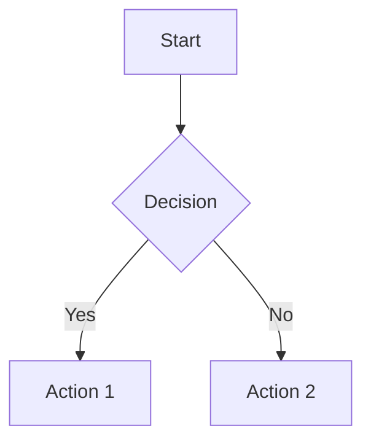
````


### Essential Rules

1. **Use triple backticks** with `mermaid` language identifier
2. **Start with diagram type declaration** (e.g., `graph`, `sequenceDiagram`, `classDiagram`)
3. **Follow consistent indentation** (spaces or tabs, but be consistent)
4. **Use meaningful node IDs** that describe the component
5. **Keep lines under 100 characters** for better readability

## Flowcharts

Flowcharts are perfect for documenting process flows, decision trees, and system architectures.

### Basic Flowchart Syntax

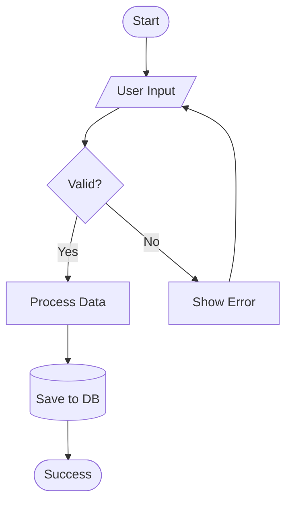

### Node Shapes

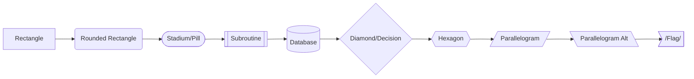

### Clean Architecture Example

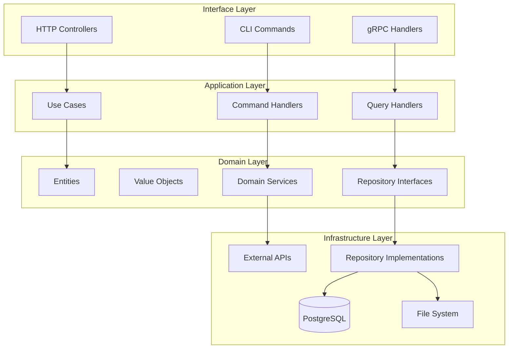

## Sequence Diagrams

Perfect for documenting API interactions, system communications, and process flows over time.

### Basic Sequence Diagram

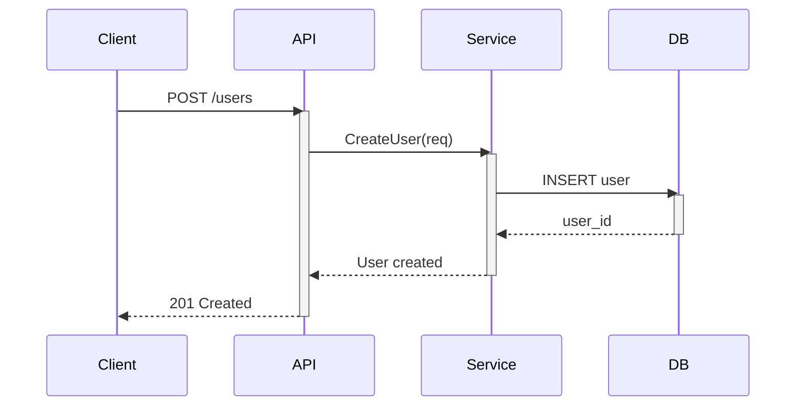

### CQRS Pattern Example

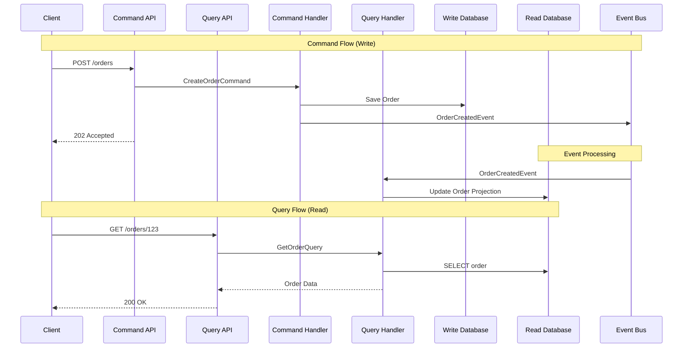

### Error Handling Flow

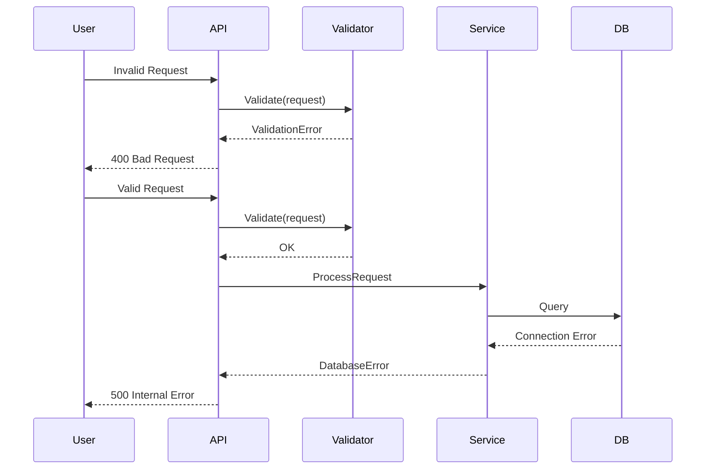

## Class Diagrams

Excellent for documenting .NET class relationships, interfaces, and object-oriented designs.

### Basic Class Diagram

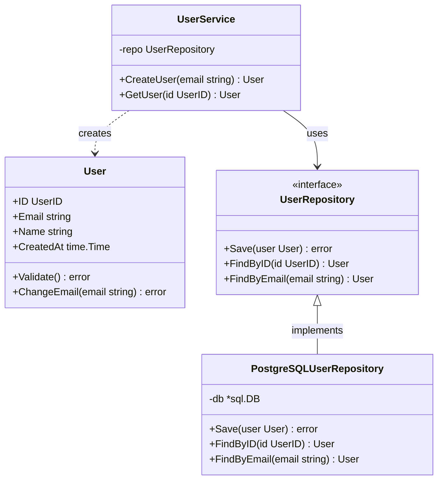

### Domain Model Example

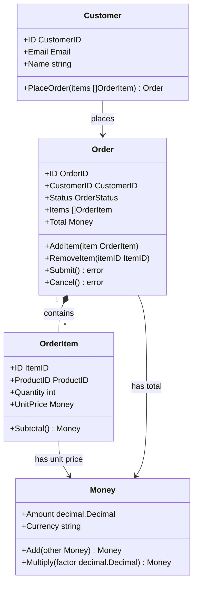

## State Diagrams

Perfect for documenting state machines, workflow states, and business process flows.

### Order State Machine

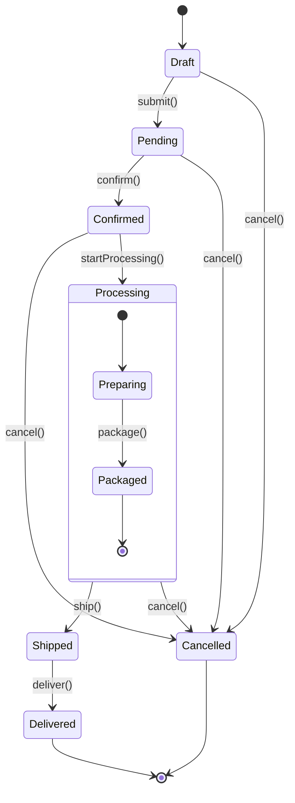

### User Authentication States

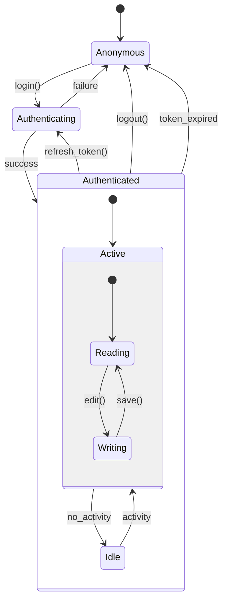

## Entity Relationship Diagrams

Great for documenting database schemas and data relationships.

### Database Schema Example

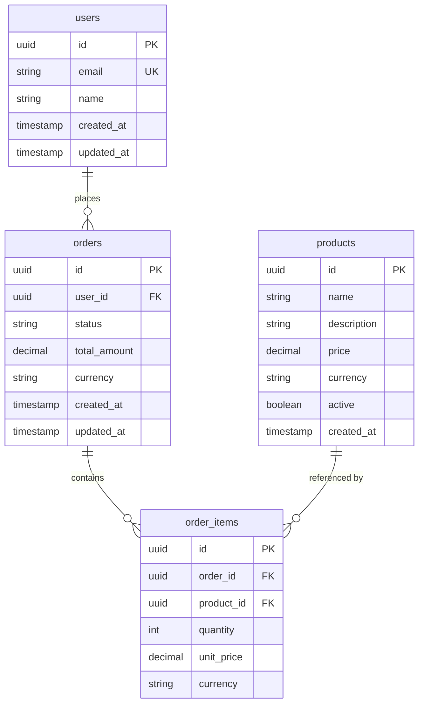

### Microservices Data Flow

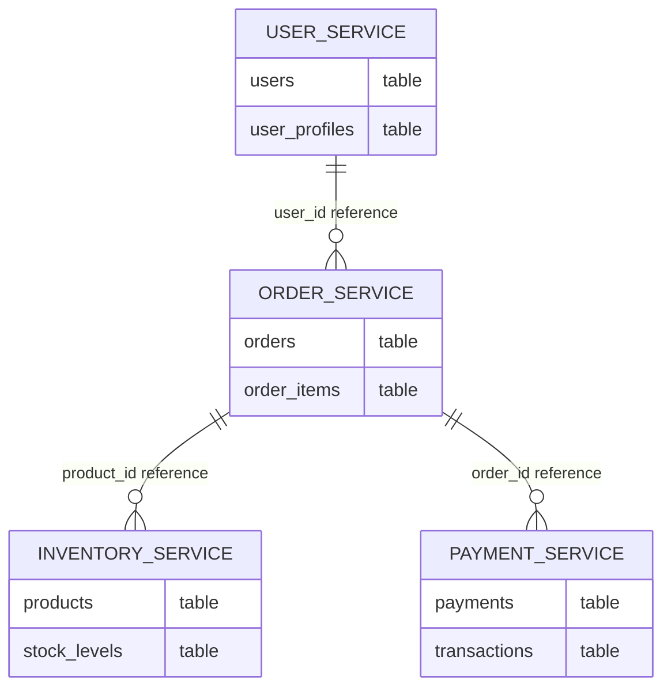

## Gantt Charts

Useful for project timelines, feature development schedules, and release planning.

### Project Timeline

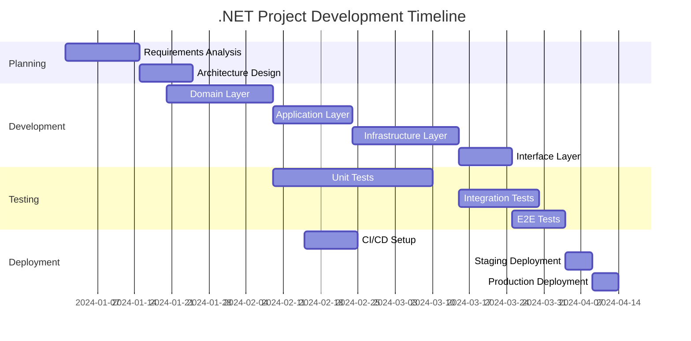

## Architecture Patterns

### Microservices Architecture

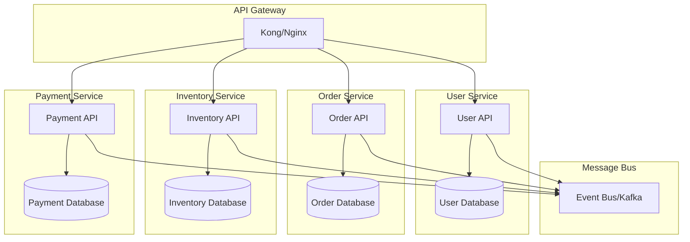

### Event-Driven Architecture

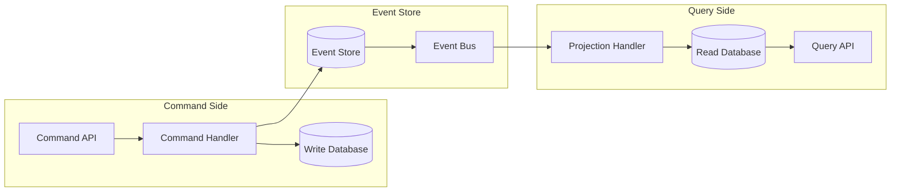

## Best Practices

### 1. Naming Conventions

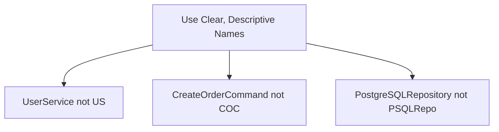

### 2. Consistent Styling

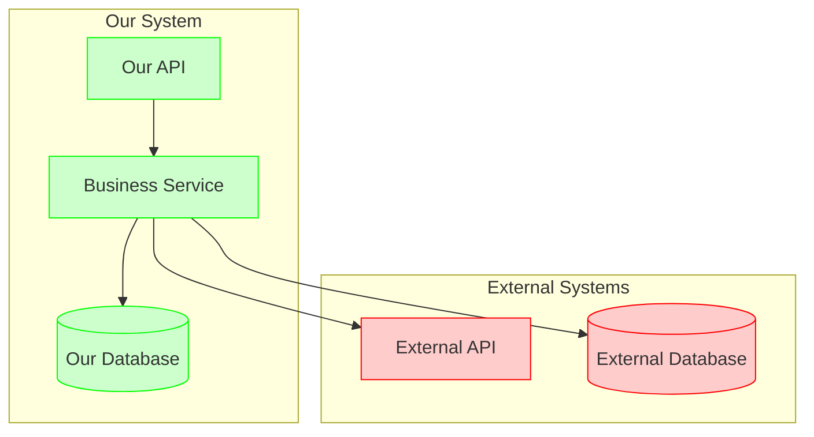

### 3. Layer Separation

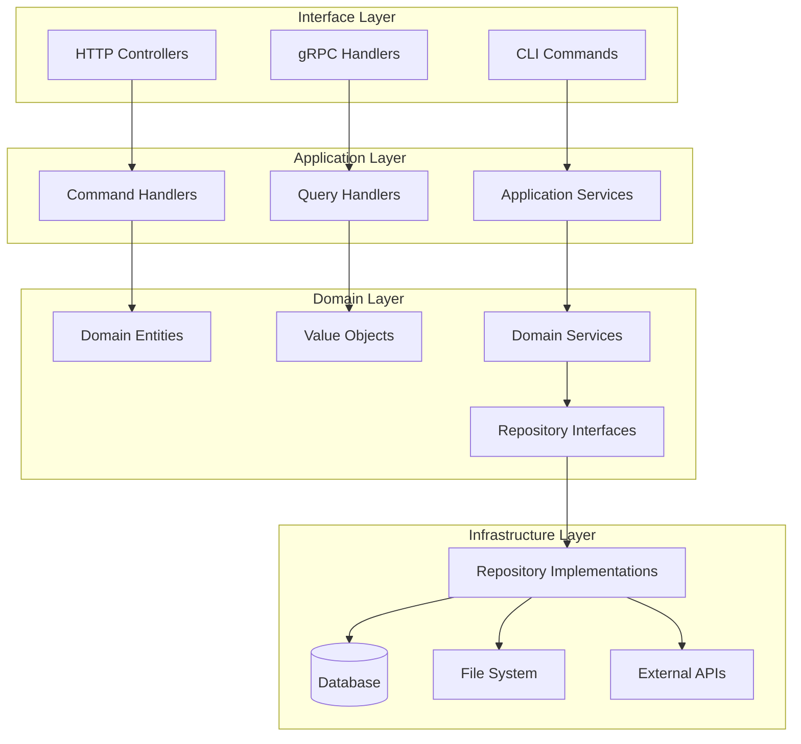

### 4. Error Flow Documentation

```mermaid
graph TD
    Start([Request]) --> Validate{Valid Input?}
    Validate -->|No| ValidationError[Validation Error]
    Validate -->|Yes| Authorize{Authorized?}

    Authorize -->|No| AuthError[Authorization Error]
    Authorize -->|Yes| Process[Process Request]

    Process --> BusinessLogic{Business Rules OK?}
    BusinessLogic -->|No| BusinessError[Business Logic Error]
    BusinessLogic -->|Yes| Persist[Persist Data]

    Persist --> DatabaseOp{Database Success?}
    DatabaseOp -->|No| DatabaseError[Database Error]
    DatabaseOp -->|Yes| Success[Success Response]

    ValidationError --> ErrorResponse[400 Bad Request]
    AuthError --> ErrorResponse2[401/403 Error]
    BusinessError --> ErrorResponse3[422 Unprocessable Entity]
    DatabaseError --> ErrorResponse4[500 Internal Server Error]

    Success --> SuccessResponse[200/201 Success]
```

## GitHub-Specific Considerations

### 1. Rendering Limitations

- **Maximum diagram size**: Keep diagrams reasonably sized for mobile viewing
- **Performance**: Very large diagrams may load slowly
- **Browser compatibility**: Test across different browsers

### 2. Accessibility

```mermaid
graph LR
    A[Clear Node Labels] --> B[Descriptive Text]
    B --> C[Good Color Contrast]
    C --> D[Logical Flow Direction]
```

### 3. Documentation Integration

```markdown
## System Architecture

The following diagram shows our Clean Architecture implementation:

```mermaid
graph TB
    %% This diagram shows the dependency flow in our Clean Architecture
    %% Dependencies point inward toward the domain layer
    subgraph "Infrastructure"
        DB[(Database)]
        API[External API]
    end

    subgraph "Interface"
        HTTP[HTTP Controllers]
    end

    subgraph "Application"
        UseCase[Use Cases]
    end

    subgraph "Domain"
        Entity[Entities]
        Repo[Repository Interface]
    end

    HTTP --> UseCase
    UseCase --> Entity
    UseCase --> Repo
    DB -.-> Repo
    API -.-> Repo
```

Key principles shown:

- Interface layer depends on Application layer
- Application layer depends on Domain layer
- Infrastructure implements Domain interfaces (dependency inversion)

### 4. File Organization

```consoletext
docs/
├── architecture/
│   ├── overview.md           # High-level system overview
│   ├── components.md         # Detailed component diagrams
│   └── data-flow.md         # Data flow diagrams
├── api/
│   ├── authentication.md    # Auth flow diagrams
│   └── endpoints.md         # API sequence diagrams
└── deployment/
    ├── infrastructure.md     # Infrastructure diagrams
    └── ci-cd.md             # CI/CD pipeline diagrams
```

## Troubleshooting

### Common Issues

1. **Diagram not rendering**

Check: -->
- Triple backticks with 'mermaid' language identifier
- Valid Mermaid syntax
- No extra spaces before diagram type

2. **Syntax errors**

   ```mermaid
   graph TD
       A[Good: Valid node ID] --> B[Another valid node]
       %% Bad: Special characters in node IDs
       %% A-1[Bad: Hyphen in ID] --> B+1[Bad: Plus in ID]
   ```

3. **Layout issues**

   ```mermaid
   graph TD
       %% Use subgraphs for better organization
       subgraph "Group 1"
           A --> B
       end

       subgraph "Group 2"
           C --> D
       end

       B --> C
   ```

### Debugging Tips

1. **Start simple** and add complexity gradually
2. **Use online editors** like [Mermaid Live Editor](https://mermaid.live/) for testing
3. **Check console errors** in browser dev tools
4. **Validate syntax** before committing

### Performance Optimization

```mermaid
graph LR
    A[Keep diagrams focused] --> B[Use subgraphs for organization]
    B --> C[Split large diagrams into multiple files]
    C --> D[Link related diagrams in documentation]
```

## Advanced Examples

### Complex Deployment Pipeline

```mermaid
graph TB
    subgraph "Development"
        Dev[Developer]
        PR[Pull Request]
        Dev --> PR
    end

    subgraph "CI/CD Pipeline"
        Build[Build & Test]
        Security[Security Scan]
        Deploy[Deploy to Staging]
        E2E[E2E Tests]
        Production[Deploy to Production]

        PR --> Build
        Build --> Security
        Security --> Deploy
        Deploy --> E2E
        E2E --> Production
    end

    subgraph "Monitoring"
        Metrics[Metrics Collection]
        Alerts[Alert System]
        Logs[Log Aggregation]

        Production --> Metrics
        Production --> Alerts
        Production --> Logs
    end

    subgraph "Environments"
        Staging[Staging Environment]
        Prod[Production Environment]

        Deploy --> Staging
        Production --> Prod
    end
```

### Multi-Service Communication

```mermaid
sequenceDiagram
    participant Client
    participant Gateway as API Gateway
    participant Auth as Auth Service
    participant User as User Service
    participant Order as Order Service
    participant Payment as Payment Service
    participant Notification as Notification Service

    Client->>Gateway: Create Order Request
    Gateway->>Auth: Validate Token
    Auth-->>Gateway: Token Valid

    Gateway->>User: Get User Details
    User-->>Gateway: User Data

    Gateway->>Order: Create Order
    activate Order
    Order->>Payment: Process Payment
    activate Payment
    Payment-->>Order: Payment Successful
    deactivate Payment

    Order->>Notification: Send Order Confirmation
    activate Notification
    Notification-->>Order: Notification Sent
    deactivate Notification

    Order-->>Gateway: Order Created
    deactivate Order
    Gateway-->>Client: 201 Created
```

### Event Sourcing Pattern

```mermaid
graph TB
    subgraph "Command Side"
        Command[Command]
        Aggregate[Aggregate]
        Events[Domain Events]
        EventStore[(Event Store)]

        Command --> Aggregate
        Aggregate --> Events
        Events --> EventStore
    end

    subgraph "Query Side"
        EventHandler[Event Handler]
        Projection[Projection]
        ReadModel[(Read Model)]

        EventStore --> EventHandler
        EventHandler --> Projection
        Projection --> ReadModel
    end

    subgraph "Snapshots"
        SnapshotStore[(Snapshot Store)]

        Aggregate --> SnapshotStore
        SnapshotStore --> Aggregate
    end
```

## Conclusion

Mermaid diagrams in GitHub provide a powerful way to document software architecture,
processes, and workflows directly in your repository. By following these patterns
and best practices, you can create maintainable, accessible, and informative
diagrams that enhance your project documentation.

### Key Takeaways

1. **Start simple** - Begin with basic diagrams and add complexity as needed
2. **Be consistent** - Use consistent naming and styling across all diagrams
3. **Document context** - Always provide explanation text around diagrams
4. **Keep it current** - Update diagrams when architecture changes
5. **Test rendering** - Verify diagrams display correctly on different devices

### Related Documentation

- [C4 Architecture Diagramming Guide](c4_diagramming_guide.md) - For auto-generated architecture diagrams
- [Project Guidelines](project_guidelines.md) - Clean Architecture implementation patterns
- [GitHub CI/CD](github_cicd.md) - Automated workflow documentation

---

*For more advanced diagramming needs, consider combining Mermaid with our C4*
*auto-generation guide for comprehensive architectural documentation.*
